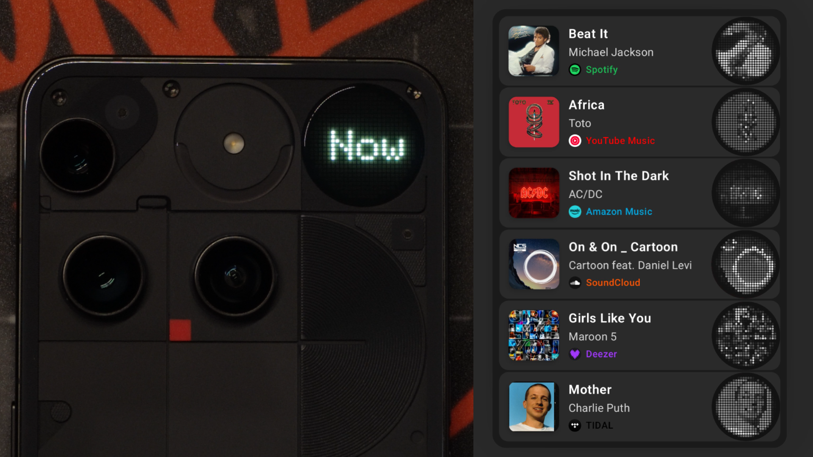

# Glyph Beat 🎵

> Transform your Nothing Phone's Glyph Matrix into a cool music visualizer with custom animations

## 🌟 Overview
**Glyph Beat** brings your Nothing Phone's Glyph interface to life with beautiful, custom and music-reactive animations.

### 🎯 Key Features

- 🎨 **10+ Unique Animation Themes** - From minimal to a dancing duck
- 📳 **Shake Controls** - Full custom shaking controls
- 🌈 **Customizable Settings** - Adjust brightness, timeout, and animation parameters
- 🚀 **Lightweight & Efficient** - Optimized for minimal battery impact
- 🔒 **Privacy-First** - No data collection, no ads, no tracking

## 🆕 Latest Update

### What's New in v2.0 

- 🔤 **Scroll-Text Theme** - Title, artist, album all flexin' on a nonstop scroll
- ⚡ **Auto-Start** - Pops up on the Matrix instantly. Zero taps, full vibes
- 📳 **Better Shake Controls** - More settings to customize shake controls at your desire
- 🌐 **Universal Media Player** - Enjoy Glyph Beat anywhere your music comes from

## 📱 Animation Themes

### Core Animations
| Theme | Description |
|-------|------------|
| **🎵 Vinyl** | Classic spinning record animation that rotates with your music |
| **🦆 Dancing Duck** | A playful duck that dances to your tunes |
| **💿 Cover Art** | Displays album artwork in a pixelated matrix style |
| **🔤 Scroll Text** | Title, artist, album all flexin’ on a nonstop scroll |
| **🎯 Minimal** | Clean, simple animation for a subtle effect |
| **👾 Glyphy** | Animated character that grooves with the music |
| **☰ More** | More to discover & coming soon |

### Track Control Themes
| Theme | Description |
|-------|------------|
| **⏭️ Minimal Arrow** | Simple arrow indicators for track navigation |

## 🔧 Technical Details

### Built With
- **Language**: Kotlin
- **UI Framework**: Jetpack Compose
- **Architecture**: MVVM with Repository pattern
- **Key Libraries**:
  - Glyph SDK for matrix control
  - MediaSession API for music detection
  - Coroutines for async operations
  - Material3 for modern UI components

## 🔐 Privacy & Security

Glyph Beat is designed with privacy as a core principle:

- ✅ **No Data Collection** - We don't collect any personal information
- ✅ **No Internet Access** - Except for optional donation links & some cover arts
- ✅ **Local Processing** - All animations are generated on-device
- ✅ **Open Source** - Full transparency in our code

[Read our full Privacy Policy](https://pauwma.github.io/GlyphBeat/privacy.html)

## 🤝 Contributing

We welcome contributions from the community!

### Reporting Issues
- 🐛 [Report bugs](https://github.com/pauwma/GlyphBeat/issues/new?labels=bug)
- 💡 [Request features](https://github.com/pauwma/GlyphBeat/issues/new?labels=enhancement)
- 💬 [Ask questions](https://privacidad.me/@pauwma)

## 💖 Support Development

If you enjoy Glyph Beat, consider supporting its development:

## 📄 License

This project is licensed under the MIT License - see the [LICENSE](LICENSE) file for details.

## 🙏 Acknowledgments

- **Nothing Technology** - For creating innovative hardware that inspires creativity
- **Nothing Community** - For the amazing support and feedback
- **Contributors** - Everyone who has helped improve Glyph Beat
- **Open Source Libraries** - The amazing tools that make this possible

---

**Made with 🤍 for the Nothing Community**

[Website](https://pauwma.github.io/GlyphBeat) • [Privacy Policy](https://pauwma.github.io/GlyphBeat/privacy.html) • [Play Store](https://play.google.com/store/apps/details?id=com.pauwma.glyphbeat)

